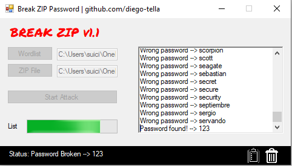

# Brute-Zip
Simple brute force in zip files. 

<h1>Cracked: </h1>

<h1>Corrections</h1>
I fixed all the bugs and the program can be used normally to crack passwords from zip files. If you find a new bug, or have suggestions, <A HREF="mailto:diegotellaroli05@gmail.com">contact me</A>!

